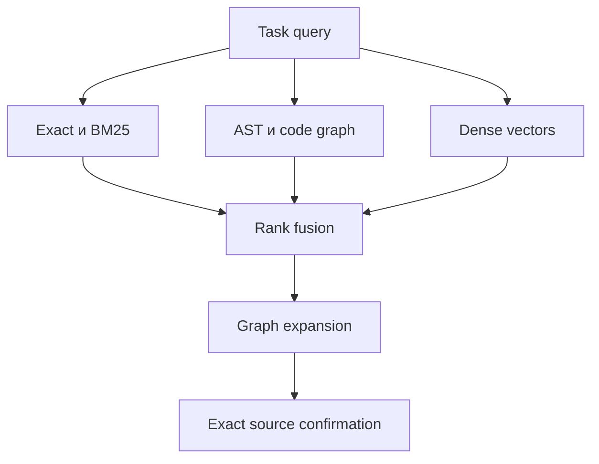

# Practice Loop — масштабируемая кодовая память

> Статус: RFC-компонент Memory v2.  
> Версия: 0.1 от 2026-08-13.  
> Область: локальная память исходного кода для Freebuff и других project agents.  
> Первичный источник истины всегда Git checkout; индекс полностью воспроизводим и не коммитится.

## 1. Итоговое решение

Векторная память для кода нужна, потому что проект будет существенно расти и многие модули первой
очереди ещё не реализованы. Но отдельный vector search не решает навигацию по коду: он хорошо находит
похожие смыслы, но не гарантирует callers, imports, migrations, side effects и tests.

Поэтому используется hybrid retrieval:



- exact search отвечает «где именно»;
- graph отвечает «что связано и что сломается»;
- vectors отвечают «где реализована похожая идея, даже если термины отличаются»;
- Git/tests/migrations подтверждают вывод;
- context pack получает ссылки и причины, а не слепую выгрузку top-k chunks.

## 2. Почему vectors полезны именно этому проекту

По мере реализации Personal, Social, Dynamics, mobile API, media/health и расширения LockTimer одна
концепция будет проявляться в разных слоях: route, service, repository, model, template, JS, migration
и test. Названия не всегда совпадут с формулировкой задачи на русском. Semantic retrieval поможет:

- найти аналогичный workflow в другом bounded context;
- обнаружить код, реализующий концепцию без ожидаемого имени;
- найти precedent для ошибок timezone, consent, state transitions или JSON contracts;
- подобрать релевантные tests и migration examples;
- восстановить контекст нового модуля до появления отдельной wiki page.

Vectors не используются для доказательства полного impact: семантически непохожий consumer может
быть критичным, и его обязан найти graph/exact search.

## 3. Storage decision

### Основной пилот: Qdrant local mode

`memoryctl` использует `qdrant-client` в local/persistent mode. Это dev-only хранилище внутри
`.memory-local/code-index/`, без Docker и сетевого порта. Выбор обусловлен:

- payload filters по repo/path/language/kind/scope;
- dense, sparse и hybrid query contract;
- возможность named vectors и последующего reranking;
- переход на отдельный Qdrant server без смены схемы records/query API;
- официальный local mode для небольших persistent indexes.

Поддержка конкретных hybrid-возможностей local mode проверяется pinned integration tests. Если
server-side fusion недоступен или ведёт себя иначе, `memoryctl` выполняет BM25/dense fusion
детерминированно на клиенте; это не причина молча менять retrieval contract.

Agent не подключается к Qdrant напрямую. Единственный writer — `memoryctl index-code`; retrieval идёт
через `memoryctl search-code` или узкий project MCP. Это предотвращает самовольное сохранение
«воспоминаний» и позволяет жёстко проверять HEAD/denylist.

### Рассмотренные альтернативы

| Вариант | Решение | Причина |
|---|---|---|
| Qdrant local → server | Основной пилот | Hybrid/payload filters и понятный путь роста |
| LanceDB embedded | Резервный | Хороший embedded API, но другой operational path при server-scale |
| `sqlite-vec` | Не основной сейчас | Компактный, но pre-v1 и ограничения сложной metadata filtering/ANN |
| QMD | Только docs | Хорош для Markdown knowledge, не заменяет code-unit parser/graph |
| Remote vector SaaS | Запрещён по умолчанию | Исходники не должны покидать локальную среду без отдельного решения |

Storage adapter остаётся внутренним интерфейсом, чтобы benchmark мог заменить реализацию.

## 4. Единица индексации

Запрещён основной режим «каждые N tokens с overlap». Chunk строится по структуре языка.

| Язык/файл | Code units |
|---|---|
| Python | module, class, function, method, FastAPI route, SQLAlchemy model |
| Alembic | revision, upgrade/downgrade operation group |
| Jinja2 | template block, macro, form/action region |
| JavaScript | function, event handler, API interaction |
| YAML/TOML | semantic config section |
| Tests | test function/class, fixture, parametrized case group |

Если function/class превышает лимит embedding model, parser сначала выделяет вложенные units и
логические AST blocks. Parent record хранит signature/docstring/outline, children — body fragments с
parent ID. Line overlap применяется только на безопасной границе и фиксируется parser version.

### Retrieval text

Векторизуется нормализованное представление:

```text
scope + path + language + unit kind
qualified symbol + signature/decorators/route metadata
docstring/comments
normalized body or structural outline
related domain terms from accepted knowledge pages
```

LLM summary не обязателен. Если он используется, это отдельное derived field с model/revision,
prompt hash и source content hash; исходный unit остаётся доступен для подтверждения.

## 5. Metadata и идентичность

Минимальный payload определён в `MEMORY_SCHEMA.md`. Дополнительно допускаются:

- `route_method`, `route_path`;
- `imports`, `calls_out` как компактные IDs, если graph backend этого не хранит;
- `test_targets`, `migration_revision`;
- `bounded_context`, `risk_tags` (`auth`, `safety`, `privacy`, `migration`, `llm`);
- `is_generated`, `is_vendor`, `is_test`;
- `summary_hash`, `embedding_created_at`.

Point ID content-addressed. Неизменившаяся единица переиспользует embedding. Collection manifest,
а не каждый point, связывает snapshot с HEAD. Для разных worktrees используются разные local paths,
чтобы переключение ветки не смешивало snapshots.

## 6. Embedding profile

Модель не фиксируется до benchmark. Profile обязан включать:

- provider: `local` по умолчанию;
- model ID и immutable revision/digest;
- dimensions, normalization и pooling;
- максимальную длину input;
- tokenizer version;
- languages benchmark (`ru` task query, `en` identifiers/code, Python/Jinja/JS);
- device и quantization, если применимо.

Кандидаты сравниваются на реальных задачах Practice Loop. Общая multilingual-модель может лучше
понимать русские запросы, code-specific — реализацию; при необходимости Qdrant хранит два named
vectors. Двухвекторный режим включается только если прирост recall оправдывает disk/latency.

Remote embedding API возможен только как explicit opt-in после security/privacy ADR. До этого весь
source и embeddings остаются локально.

## 7. Индексация

`memoryctl index-code`:

1. разрешает real repo root и worktree ID;
2. читает allowlist/denylist и вычисляет `ignore_hash`;
3. фиксирует HEAD, parser и embedding profile;
4. строит/обновляет structural units;
5. сравнивает content hashes с предыдущим manifest;
6. удаляет units удалённых/переименованных файлов;
7. пересчитывает embeddings только для новых/изменённых units;
8. проверяет coverage и случайную выборку source spans;
9. атомарно переключает manifest на `ready`;
10. никогда не оставляет partially updated collection активной.

Режимы:

- `full` — первый запуск, parser/model/ignore schema changed;
- `incremental` — diff предыдущего indexed HEAD → текущий HEAD;
- `check` — ничего не пишет, только сообщает freshness/coverage;
- `shadow` — индекс участвует в метриках, но не влияет на обязательный context pack;
- `rebuild` — создаёт новую collection и атомарно переключает alias.

Uncommitted diff индексируется в отдельный overlay по current file hash. Он не меняет базовую
collection и удаляется при close/reset. Agent обязан видеть, что result пришёл из `HEAD` или overlay.

## 8. Query pipeline

`memoryctl search-code --query <task> --paths <optional>`:

1. классифицирует query и извлекает known symbols/paths/domain/risk;
2. применяет hard filters: repo/worktree, freshness, allowlist, language/kind/scope;
3. запускает exact symbol/path search;
4. параллельно получает lexical/BM25, graph и dense-vector candidates;
5. объединяет rankings через RRF/настраиваемый fusion с объяснимыми компонентами;
6. для impact-задач усиливает graph, для precedent/concept — semantic signal;
7. расширяет top units на один контролируемый hop: callers/callees/tests/migrations/templates;
8. удаляет duplicates по symbol/content hash;
9. перечитывает exact spans из worktree и отклоняет несовпадения;
10. возвращает top results с reason/evidence и token budget.

Vector similarity не повышает authority. Safety/product contract из L0/L1 добавляется независимо.

### Ответ search-code

Каждый result содержит:

- `path`, `symbol`, `span`, `blob_sha`/overlay hash;
- `unit_kind`, `scope`, `risk_tags`;
- score components: exact, lexical, graph, dense, rerank;
- `matched_by` и краткую причину;
- graph neighbors, добавленные в impact frontier;
- `confirmation: exact-read` или явный отказ.

Agent не получает только текст chunk без location/provenance.

## 9. Graph contract

`codebase-memory-mcp` запускается как read-only scout:

- root ограничен текущим worktree;
- version pinned;
- cache local/gitignored;
- до использования вызывается coverage/freshness check;
- разрешены definitions, references, imports, call paths, dependency/impact queries;
- запись ADR/wiki и repo mutation запрещены.

Если MCP не покрывает Jinja/HTMX/Alembic edge, `memoryctl` добавляет project-specific links из routes,
template names, endpoint calls и migration metadata. Coverage gaps сохраняются как metrics, а не как
ложное доказательство отсутствия зависимости.

## 10. Масштабирование

Не вводится жёсткий порог «N файлов». Переход local → Qdrant server рассматривается, когда в
benchmark наблюдается одно из условий:

- cold start/full build неприемлем для рабочего цикла;
- p95 hybrid query превышает согласованный latency budget;
- incremental update регулярно не укладывается в preflight budget;
- индекс не помещается в разумный RAM/disk budget рабочей машины;
- несколько агентов/worktrees должны безопасно разделять один read-mostly index.

Server остаётся development infrastructure, не частью production Practice Loop. Collection namespace
включает repository, parser schema и embedding profile; branch/worktree isolation сохраняется.

## 11. Privacy, supply chain и отказоустойчивость

- индексируются только committed allowlisted source paths и explicit uncommitted overlay;
- `.env*`, uploads, dumps, logs, raw LLM/user data, backups, vendor/minified/binary исключены;
- symlink outside root блокируется;
- embedding model и packages pinned по revision/hash;
- direct network egress индексатора запрещён, кроме отдельно одобренного provider;
- Qdrant local directory и model cache не коммитятся;
- повреждённый/stale index удаляется и пересобирается из Git;
- недоступные vectors переводят retrieval в degraded exact+graph mode;
- недоступный graph переводит retrieval в exact+BM25+vectors, но impact помечается incomplete;
- одновременно недоступные graph и exact confirmation блокируют code-changing task.

## 12. Benchmark и gates

Набор из `MEMORY_IMPLEMENTATION_PLAN.md` расширяется русскоязычными формулировками, синонимами и
задачами, где имя реализации не совпадает с запросом.

Метрики:

- recall@5 и MRR для expected code units;
- impact recall для всех заранее размеченных consumers/tests/migrations;
- доля vector-only false positives;
- число exact file reads до первого релевантного unit;
- context bytes/tokens;
- full/incremental index time, query p50/p95, disk/RAM;
- coverage по языкам и unit kinds;
- доля queries, ушедших в degraded mode.

Этапы допуска:

1. `off` — только parser/schema tests.
2. `shadow` — vector results пишутся в benchmark report.
3. `assist` — vector candidates видимы агенту, но не формируют impact без подтверждения.
4. `required` — только после 10–15 задач, privacy review и стабильного fallback.

Ухудшение exact/graph recall недопустимо, даже если semantic search выглядит удобнее.

## 13. Acceptance criteria

- каждый vector point соответствует существующей AST-единице и exact source span;
- manifest однозначно привязан к worktree HEAD и полному embedding profile;
- incremental update корректно обрабатывает add/modify/delete/rename;
- смена parser/model/ignore hash вызывает новый namespace/rebuild;
- code и embeddings не покидают локальную машину по умолчанию;
- agent не имеет прямой записи в vector store;
- results объяснимы и подтверждены исходником;
- graph обязателен для impact либо результат явно incomplete/blocked;
- stale/partial collection никогда не участвует в normal mode;
- fallback позволяет работать без vector dependency;
- переход к server не меняет canonical memory и формат context pack.

## 14. Первичные ссылки

- Qdrant local quickstart: <https://qdrant.tech/documentation/quickstart/>
- Qdrant hybrid queries: <https://qdrant.tech/documentation/search/hybrid-queries/>
- Qdrant points/payload: <https://qdrant.tech/documentation/manage-data/points/>
- Qdrant distributed deployment: <https://qdrant.tech/documentation/scaling/distributed_deployment/>
- LanceDB SDK: <https://lancedb.github.io/lancedb/>
- sqlite-vec: <https://github.com/asg017/sqlite-vec>
- codebase-memory-mcp: <https://github.com/DeusData/codebase-memory-mcp>
