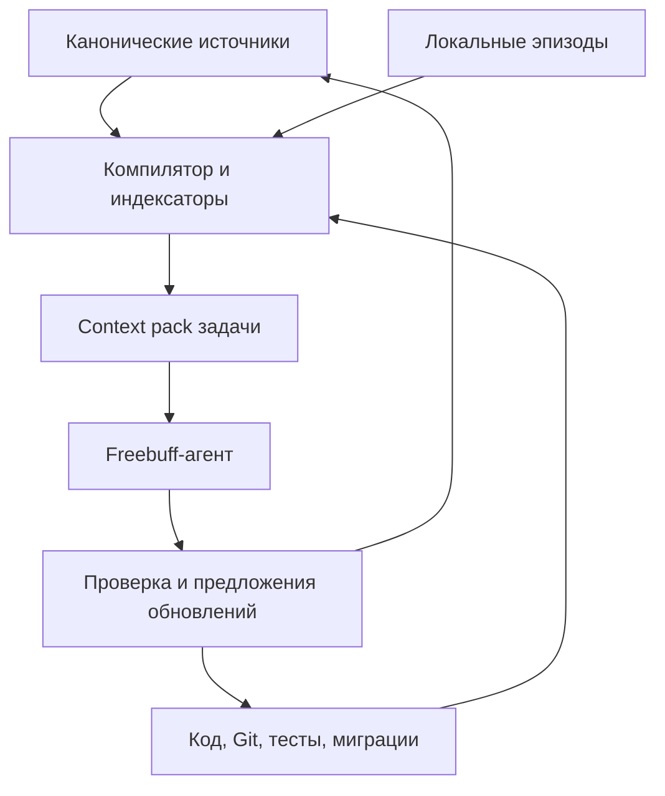

# Practice Loop — архитектура памяти Memory v2

> Статус: RFC, не является действующим контрактом до отдельного решения владельца и ADR.  
> Версия: 0.2 от 2026-08-13.  
> База анализа: `main` на `4ed5eec` (S96). Перед внедрением база должна быть проверена повторно.  
> Область: память и рабочий контекст агентов. Документ не меняет поведение продукта.

## 1. Решение в одном абзаце

Проекту нужна не одна «векторная память», а несколько слоёв с разной ответственностью.
Короткий контракт всегда загружается агентом; нормативные знания и решения хранятся атомарно
и компилируются в wiki; факты о текущем коде генерируются из конкретного Git HEAD; связи кода
ищутся гибридно — локальным структурным графом, BM25 и векторным индексом по AST-единицам, — но
подтверждаются исходниками, `rg`, тестами и миграциями;
сырые истории сессий остаются локальными и не попадают в публичный репозиторий. На каждый запрос
собирается небольшой проверяемый context pack. Стандартный launcher, кастомный агент, sentinel,
pre-commit и CI делают preflight обязательным в поддерживаемом процессе разработки.

## 2. Почему текущая память не масштабируется

На базе S96 каталог `memory/` содержит около 350 KiB, в том числе:

- `SESSIONS.md` — около 145 KiB;
- `STATUS.md` — около 72 KiB;
- `CHANGELOG.md` — около 34 KiB;
- `DECISIONS.md` — около 27 KiB;
- отдельные session-аудиты — ещё около 65 KiB.

При этом `AGENTS.md` требует читать большие агрегаты в начале каждой сессии и дописывать несколько
пересекающихся журналов в конце. Это создаёт четыре класса проблем:

1. **Цена контекста.** Агент получает историю, не относящуюся к задаче, раньше нужного кода.
2. **Дублирование.** Один факт повторяется в status, session log, changelog и иногда в ADR.
3. **Смешение ролей.** Продуктовое решение, фактическое состояние HEAD, план и история выглядят
   одинаково убедительно, хотя имеют разный authority.
4. **Устаревание.** Ручной snapshot начинает противоречить коду или более новому документу.

Memory v2 должна уменьшать контекст, а не добавлять ещё один обязательный большой источник.

## 3. Цели и не-цели

### Цели

- давать агенту только релевантный контекст с источниками и версией;
- различать нормативное решение, техническую ADR, проверенный факт, вывод и историю;
- находить реализацию по символам, вызовам, импортам, маршрутам, моделям и тестам;
- обнаруживать устаревший индекс или противоречивую документацию до изменения кода;
- исключить сырые сессии, секреты и пользовательские данные из публичной памяти;
- сделать обязательный preflight измеримым и проверяемым;
- сохранить один репозиторий, один deployable и одну историю Alembic.

### Не-цели

- векторизовать каждый файл и считать embedding источником истины;
- хранить копию всего исходного кода в Markdown;
- автоматически принимать продуктовые решения от имени владельца;
- давать MCP-серверам неограниченную запись в репозиторий, БД или production;
- менять архитектуру Practice Loop / LockTimer в рамках миграции памяти.

## 4. Инварианты проекта

Memory v2 обязана сохранять принятые ограничения проекта. В частности:

- `DOCUMENTATION_MAP.md` остаётся единственной картой authority; новая память не создаёт
  конкурирующую иерархию;
- факт реализации окончательно подтверждают код, миграции и реально выполненные тесты текущего HEAD;
- один Personal-first продукт не превращается обратно в две независимые системы;
- LockTimer остаётся bounded context внутри общего репозитория и deployable;
- safety/emergency stop всегда технически доступен и имеет приоритет; игровое последствие может
  существовать, но не блокирует остановку;
- Core остаётся приватным, публичность реализуется через отдельные проекции/адаптеры;
- решения владельца не создаются, не отменяются и не помечаются accepted автоматически;
- секреты, production-данные, uploads, дампы, логи и сырые ответы LLM не индексируются.

## 5. Модель слоёв



### L0 — управляющий контракт, всегда в контексте

Содержит только правила, которые нужны для любой задачи:

- короткий корневой `AGENTS.md`, целевой лимит 5–8 KiB;
- ближайший к изменяемому коду `knowledge.md`, целевой лимит до 4 KiB;
- ссылка на `DOCUMENTATION_MAP.md`, команды preflight и verification;
- запреты по safety, privacy, destructive Git и миграциям.

Локальные `knowledge.md` предлагаются как минимум для:

- `app/locktimer/`;
- `app/platform/social/` и будущего Dynamics-контекста;
- `app/llm/`;
- `alembic/`;
- `tests/`.

Файл содержит границы и ловушки области, а не пересказ её исходников.

### L1 — каноническая семантическая память

Это Karpathy-style compiled wiki: небольшие страницы по одному вопросу, собранные из неизменяемых
источников и снабжённые provenance. Она отвечает на вопросы «почему», «какое ограничение принято»
и «какой контракт должен сохраняться».

Состав:

- `docs/wiki/` — продуктовые и инженерные knowledge pages;
- `docs/adr/ADR-NNN-*.md` — отдельные решения со статусом и `supersedes`;
- `docs/questions/` — только действительно открытые вопросы;
- сгенерированные индексы, но не сгенерированные решения.

LLM может предложить страницу или обновление. Публикация нормативного изменения требует проверки,
а принятие продуктового решения — явного действия владельца.

### L2 — факты текущего состояния

Ручной длинный `STATUS.md` заменяется коротким представлением из машинно получаемых данных:

- `docs/state/FACTS.json` — генерируемый manifest;
- `docs/state/NOW.md` — краткий читаемый snapshot из manifest;
- источник каждого факта: commit, команда, workflow run, migration head или file hash;
- любой snapshot имеет `generated_at` и `head`; несовпадение HEAD делает его stale.

Примеры фактов: текущий commit, ветка, dirty state, Alembic heads, последняя реально выполненная
команда тестов, количество прошедших тестов, статус CI и версия runtime. Число тестов не переносится
из старой session note.

### L3 — гибридная память кода

Исходники остаются первичным источником. Кодовая память объединяет три независимых сигнала:

1. exact/lexical — paths, symbols, `rg`, BM25;
2. structural — definitions, imports, calls, routes, models, migrations и tests;
3. semantic — dense vectors по функциям, классам, модулям и другим AST-единицам.

Локальный индекс ускоряет навигацию:

- определения и ссылки на символы;
- импорты и зависимости модулей;
- call paths;
- маршруты → handlers → services → repositories/models;
- модель/миграция/тестовые связи;
- оценка impact для изменяемых файлов.

Для structural-пилота подходит read-only `codebase-memory-mcp`, привязанный к разрешённому корню.
Для vector-пилота используется Qdrant local mode за интерфейсом `memoryctl`: индекс живёт на диске
без отдельного сервиса, а при существенном росте тот же schema/query contract переносится в Qdrant
server. Agent не получает прямой write-tool к коллекции.

Graph и vectors хранятся локально, игнорируются Git и маркируются точным HEAD, parser version,
embedding model/revision и ignore hash. Embedding строится не по случайным token chunks, а по
структурным code units; metadata сохраняет точный path, symbol, span, blob SHA и content hash.
Любой найденный путь агент обязан проверить чтением исходного файла или точным поиском.
Существующий Tree-sitter code map Freebuff остаётся первым фильтром; graph/vector layers должны
доказать дополнительную ценность на benchmark. Полный контракт описан в `CODE_MEMORY_DESIGN.md`.

### L4 — эпизодическая память

Полные transcripts и технические traces полезны для расследования, но вредны как постоянный
startup context и рискованны для публичного репозитория.

- raw episodes: `.memory-local/episodes/`, только локально;
- runtime context: `.agent-runtime/`, только локально;
- в Git попадают лишь устойчивые уроки, ADR, активные вопросы или release notes;
- sanitization удаляет prompt-тексты, пользовательские данные, ключи, URL с токенами, сырой LLM
  output и лишние детали окружения.

### Производный context pack

Context pack — временный результат retrieval, а не ещё один источник истины. Он включает:

- исходную задачу и её hash;
- start HEAD, branch и dirty state;
- релевантные инварианты и решения со ссылками;
- найденные символы и файлы;
- риски, impact frontier и обязательные проверки;
- список использованных источников и их hashes;
- размер, время создания и статус свежести.

Целевой размер pack — до 12 KiB без включения самих исходников. Код читается точечно после pack.

## 6. Authority и разрешение конфликтов

Memory v2 расширяет метаданные, но не меняет действующую карту документации.

| Тип утверждения | Источник | Правило |
|---|---|---|
| Safety/privacy | Самое строгое действующее ограничение | Имеет приоритет при конфликте |
| Продуктовая цель и границы | `PRODUCT_DECISIONS.md`, `PRODUCT_VISION.md`, `ROADMAP.md` | Только accepted-решения |
| Фактическая реализация | Код, migration, выполненный тест, CI текущего HEAD | Snapshot без совпавшего HEAD stale |
| Техническое решение | Текущая ADR | Новая ADR должна явно `supersede` или `refine` старую |
| Инструкция агенту | `AGENTS.md` и ближайший `knowledge.md` | Не превращается в продуктовую истину |
| Сводка/wiki | Ссылки на источники | Derived-страница никогда не сильнее источника |
| История | Git и архив v1 | Не используется как текущий контракт без подтверждения |

Если два accepted-источника одного уровня противоречат друг другу, agent не выбирает удобный:
он фиксирует конфликт в context pack и останавливает затрагивающее решение до уточнения.

## 7. Retrieval-процесс

`memoryctl bootstrap --task <text>` выполняет детерминированный preflight:

1. фиксирует repo root, HEAD, branch, dirty state и diff scope;
2. классифицирует задачу: продукт, факт, код, UI, данные, security, deploy;
3. загружает L0 и соответствующую строку authority из `DOCUMENTATION_MAP.md`;
4. выбирает accepted/current pages по scope, path и явным связям;
5. ищет код сначала по символам/графу, затем подтверждает `rg` и чтением файлов;
6. добавляет миграции, тесты, call sites и security boundaries в impact frontier;
7. исключает denylisted paths и stale artifacts;
8. пишет context pack и sentinel с hashes;
9. возвращает короткое резюме агенту.

Порядок ранжирования: обязательный contract → точное совпадение path/symbol → scope → действующее
решение → графовая близость/лексический поиск → semantic similarity. Embeddings допускаются только
для генерации кандидатов и не могут повышать authority или скрывать stale status.

## 8. Обязательное использование Freebuff

Одна инструкция «всегда читай память» не является гарантией. Поддерживаемый путь строится в
несколько рубежей:

1. `bin/practice-agent "<task>"` — единственная документированная точка входа;
2. кастомный `.agents/practice-loop.ts` через `handleSteps` первым шагом запускает
   `memoryctl bootstrap`; возможность жёстко закрыть write-tools до preflight проверяется против
   pinned SDK, а при её отсутствии gate обеспечивают launcher и sentinel;
3. `.agents/skills/project-memory/SKILL.md` задаёт единый workflow retrieval/impact/close;
4. успешный preflight создаёт `.agent-runtime/session.json` с `head` и `task_hash`;
5. `memoryctl impact` проверяется перед завершением значимого изменения;
6. pre-commit отклоняет commit без свежего sentinel или при сменившемся HEAD;
7. CI `memory-lint` проверяет schema, provenance, denylist и generated state;
8. launcher записывает факт прямого обхода стандартного агента как unsupported workflow.

Это обеспечивает обязательность внутри стандартного процесса и на merge boundary. Администратор
с shell-доступом технически может обойти локальные hooks, поэтому защищённая ветка и required CI
остаются последним рубежом.

## 9. Индексы и внешние инструменты

### Что внедрять

| Возможность | Кандидат | Режим |
|---|---|---|
| Wiki-компиляция | Паттерн LLM Wiki / собственный compiler | LLM делает draft; lint и publish детерминированы |
| Документный поиск | Сначала `rg`/BM25; затем A/B с QMD | Только docs/wiki, local-only |
| Кодовый граф | `codebase-memory-mcp` | Read-only, allowlisted root, cache по HEAD |
| Векторный поиск кода | Qdrant local mode через `memoryctl` | Shadow mode; code units, payload filters, cache по HEAD |
| GitHub-контекст | GitHub MCP | PR/issues/CI, минимальные права |
| UI-проверка | Playwright MCP | Verifier-профиль, только по задаче |
| Runtime incidents | Sentry MCP при появлении Sentry | Read-only scout, без автоматических исправлений |

### Что не делать

- не индексировать код произвольными fixed-token chunks и не использовать vectors как authority;
- не отдавать каждому агенту все MCP tools;
- не разрешать MCP менять ADR, production БД или секреты;
- не коммитить code graph, embeddings или transcript cache;
- не использовать доступ к production как замену тестам и observability.

MCP-конфигурация должна быть per-agent. Scout получает только чтение, Builder — локальные изменения,
Verifier — тесты/браузер, а security-проверки выполняются детерминированно в CI.

## 10. Security и privacy

Индекс строится по allowlist committed paths. Минимальный denylist:

- `.env*`, ключи, credentials и auth caches;
- `.memory-local/`, `.agent-runtime/`, raw transcripts;
- `uploads/`, media, exports и пользовательские examples;
- `*.db`, dumps, backups, production logs;
- raw LLM requests/responses и debug payloads;
- vendored/minified/binary assets, включая fonts и крупные JS bundles.

Версии MCP и actions фиксируются. Каждый server получает отдельный профиль прав, timeout и
разрешённый root. Перед публикацией memory compiler запускает secret scan и проверяет, что все
ссылки остаются внутри репозитория.

Security — не «память MCP». В CI по этапам добавляются Semgrep, dependency scan (`pip-audit` или
OSV-Scanner), Gitleaks, Trivy и CodeQL. LLM/security plugin может помогать triage, но не заменяет
воспроизводимые проверки.

## 11. Целевая структура

```text
AGENTS.md
knowledge.md
AGENT_MEMORY_V2_TASK.md
CODE_MEMORY_DESIGN.md
app/.../knowledge.md
docs/
  adr/
  questions/
  state/
    FACTS.json
    NOW.md
  wiki/
memory/
  README.md              # указатель на v2 и frozen v1
.agents/
  practice-loop.ts
  mcp.json
  skills/project-memory/SKILL.md
bin/practice-agent
tools/memoryctl/
.agent-runtime/           # gitignored
.memory-local/            # gitignored
```

Старые `memory/*` не удаляются во время перехода и не переписываются массово. После проверки
эквивалентности они получают frozen/archived status; Git history остаётся историческим источником.

## 12. Наблюдаемость и критерии готовности

Минимальные метрики:

- доля сессий стандартного агента с валидным preflight: 100%;
- always-on context: не более 10 KiB суммарно;
- context pack: не более 12 KiB, кроме явно объяснённого override;
- все canonical claims имеют authority и provenance;
- generated artifacts совпадают с HEAD или явно marked stale;
- raw sessions/secrets в новых Git commits: 0;
- дублирование одного session outcome по нескольким журналам: 0;
- owner decisions, принятые автоматически: 0;
- stale code graph, использованный без отказа/перестроения: 0.
- vector result без exact source confirmation, попавший в итоговый impact: 0.

Перед включением QMD, code graph или vector index как обязательной зависимости проводится A/B на
10–15 старых задачах: время до первого релевантного файла, recall релевантных источников в top-5,
размер контекста,
число лишних чтений и пропущенных call sites. Инструмент остаётся optional, если улучшение не доказано.

## 13. Отказоустойчивость

- Нет embeddings/MCP: использовать `rg`, Git и точечное чтение; работа не блокируется.
- Индекс другого HEAD: удалить/перестроить; не пытаться «доверять примерно».
- Compiler не смог классифицировать claim: сохранить proposal локально и запросить review.
- Конфликт authority: остановить только конфликтующую часть задачи, показать источники.
- Повреждённая локальная память: удалить cache и воспроизвести из Git; canonical data не теряется.
- Текущий agent меняет пересекающиеся файлы: не выполнять миграцию, синхронизироваться после push.

## 14. Ссылки для оценки, не нормативные зависимости

- Karpathy, LLM Wiki pattern: <https://gist.github.com/karpathy/442a6bf555914893e9891c11519de94f>
- QMD local search: <https://github.com/tobi/qmd>
- codebase-memory-mcp: <https://github.com/DeusData/codebase-memory-mcp>
- Qdrant local quickstart: <https://qdrant.tech/documentation/quickstart/>
- Qdrant hybrid queries: <https://qdrant.tech/documentation/search/hybrid-queries/>
- Freebuff: <https://github.com/CodebuffAI/freebuff>
- Codebuff knowledge files: <https://www.codebuff.com/docs/tips/knowledge-files>
- Codebuff skills: <https://www.codebuff.com/docs/tips/skills>
- Codebuff MCP: <https://www.codebuff.com/docs/tips/mcp-servers>
- Codebuff custom agents: <https://www.codebuff.com/docs/agents/customizing-agents>
- Playwright MCP: <https://github.com/microsoft/playwright-mcp>
